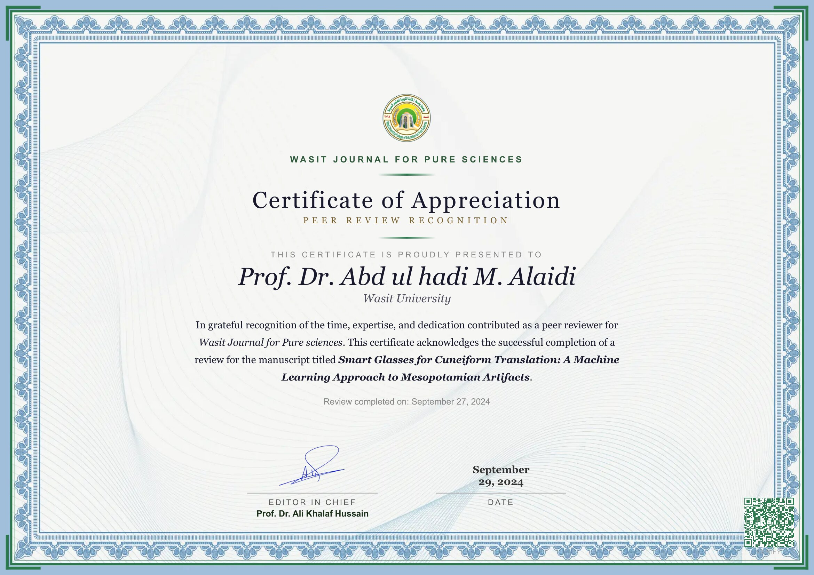
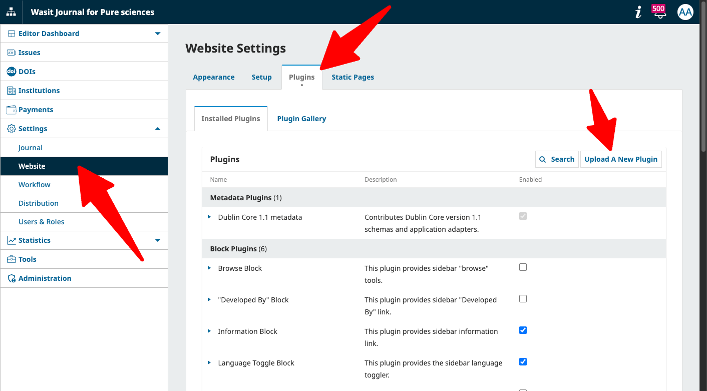
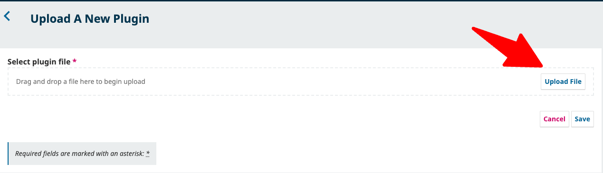
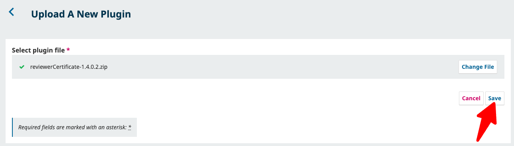
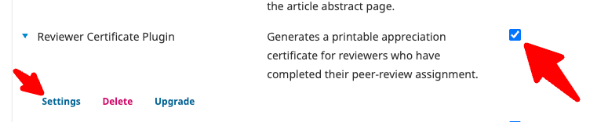

<div dir="rtl">

# إضافة شهادة المُحَكِّم لنظام OJS 3.5

> 🌐 **اللغة:** [English](README.md) · **العربية**

إضافة عامة (Generic plugin) لنظام المجلات المفتوحة (Open Journal Systems – OJS 3.5)
تُنشئ وتُسلِّم تلقائيًا شهادات تقدير أنيقة للمُحكِّمين.

## لقطة الشاشة



## المزايا

- **توليد تلقائي للشهادة** — يبدأ عند ضغط المحرر على "شكر المُحكِّم" في مراجعة مكتملة.
- **إشعار بريدي اختياري** — يمكن إيقاف رسالة الشكر التي تحمل رابط الشهادة؛ تبقى الشهادة مُنشأة ويمكن الوصول إليها من صفحة مراجعة المُحكِّم وصفحة "شهاداتي".
- **حفظ كصفحة HTML ثابتة** — تُحفظ الشهادة في `public/site/images/{username}/` ويُضمَّن رابط مباشر في رسالة الشكر.
- **تنزيل كصورة** — يستطيع المُحكِّم تنزيل صورة PNG عالية الدقة (2880 × 2034 بكسل) من لوحة التحكم مباشرة.
- **PDF من جهة الخادم** — ملف PDF بصفحة واحدة كاملة بـ `wkhtmltopdf` (مقاس 297 × 210 مم بدقة، دون تحجيم أو فراغات زائدة).
- **طباعة / حفظ كـ PDF** — نافذة طباعة المتصفح بتخطيط أفقي.
- **صفحة "شهاداتي"** — قائمة مركزية بكل شهادة حصل عليها المُحكِّم، مع بحث وترقيم صفحات، مرتبطة من القائمة الجانبية للمُحكِّم.
- **تحقق برمز QR** — رمز QR اختياري يعيد إلى صفحة الشهادة الحيّة، بحجم قابل للضبط (20–300 بكسل) وتموضع دقيق بالبكسل على المحورين X/Y.
- **زر لوحة المُحكِّم** — زر "نزّل شهادتك" يُحقن في الخطوة الثالثة من مسار المراجعة.
- **محتوى متعدد اللغات** — اسم المحرر ولقبه ونص متن الشهادة، كل منها قيمة منفصلة لكل لغة مدعومة في المجلة؛ تُعرض الشهادة باللغة المطلوبة مع التراجع الآمن إلى اللغة الأساسية.
- **تنسيق تاريخ حسب اللغة** — يستخدم امتداد PHP `intl` عند توفّره؛ صيغة تاريخ قابلة للضبط مع تجاوز اختياري للغة التاريخ (تلقائي افتراضيًا، يتبع لغة الشهادة).
- **تحكم بالإظهار/الإخفاء والتحريك** — تشغيل/إيقاف كل عنصر على حدة (اسم المجلة، العنوان الرئيسي، العنوان الفرعي، عبارة "مُقدَّمة إلى"، اسم المُحكِّم، نص المتن، سطر التاريخ، رمز QR، الشعار، التوقيع).
- **إزاحة المحتوى** — تحريك كل محتوى الشهادة لأعلى أو لأسفل بقيمة بالبكسل.
- **مظهر قابل للتخصيص**
  - لون مميِّز مع سمات جاهزة (ذهبي، أزرق، داكن، زمردي)
  - **لون النص** للعنوان واسم المُستلِم والمتن
  - حجم ولون خط اسم المجلة
  - حجم ولون خط اسم المحرر
  - نص متن مخصص للشهادة (لكل لغة)
  - رفع صورة توقيع مع التحكم بالحجم
  - رفع صورة شعار مع التحكم بالحجم
  - رفع صورة خلفية (الحجم المُوصى به: **1920 × 1357 بكسل**، نسبة A4 أفقي)
- **انتساب المُحكِّم** — يُعرض الانتساب المؤسسي للمُحكِّم أسفل اسمه (عند ظهور اسم المُحكِّم ووجود بيانات الانتساب).
- **دعم العربية / RTL** — تخطيط كامل من اليمين لليسار بخطّي Amiri و Cairo؛ عناوين المجلة والمخطوطة بخط مائل.

## أبعاد الشهادة

| | المقاس | ملاحظات |
|---|---|---|
| العرض في CSS | 960 × 678 بكسل | نسبة A4 أفقي بالضبط (297:210) |
| الخلفية المُوصى بها | **1920 × 1357 بكسل** | جودة retina ×2 |
| تنزيل PNG | 2880 × 2034 بكسل | تكبير ×3، نحو 246 dpi بمقاس طباعة A4 |

## التثبيت

يجب أن يكون اسم مجلد الإضافة **بالضبط** `reviewerCertificate` وأن يقع في
`plugins/generic/` ضمن تثبيت OJS (المسار النهائي:
`plugins/generic/reviewerCertificate/`). لا تُجرى أي تغييرات على قاعدة
البيانات عند التثبيت — تسجِّل الإضافة فقط بوابة (gateway) وبعض الـ hooks
أثناء تفعيلها.

### الخيار أ — أرشيف الإصدار (مُوصى به)

1. نزّل أحدث أرشيف من
   [صفحة الإصدارات](https://github.com/alaidi/reviewerCertificate/releases).
2. فُكّ الضغط داخل `plugins/generic/`:

   ```bash
   cd /path/to/ojs/plugins/generic
   unzip ~/Downloads/reviewerCertificate-1.4.0.2.zip
   # تأكد أن المجلد الناتج هو بالضبط: reviewerCertificate/
   ```

3. امنح مستخدم خادم الويب صلاحية الوصول (يجب أن يقرأ الإضافة ويكتب في
   `public/` لرفع الصور وحفظ الشهادات):

   ```bash
   chown -R www-data:www-data reviewerCertificate
   ```

4. سجّل الدخول كـ **مدير المجلة ← الإعدادات ← الموقع ← الإضافات ← الإضافات العامة**.
5. فعّل **Reviewer Certificate** ثم اضغط **الإعدادات** للضبط.

### الخيار ب — استنساخ Git

```bash
cd /path/to/ojs/plugins/generic
git clone https://github.com/alaidi/reviewerCertificate.git
git -C reviewerCertificate checkout v1.4.0.2
```

ثم فعّلها من صفحة الإضافات كما في الخيار أ.

> اختياري: ثبّت `wkhtmltopdf` على الخادم لتنزيل PDF بضغطة واحدة
> (يُكتشف تلقائيًا، أو حدّد المسار في الإعدادات ← توليد PDF).

### الإعداد داخل OJS بالصور

إذا كنت تفضّل تثبيت الإضافة من داخل لوحة تحكم OJS نفسها، فاتبع الخطوات
الآتية:

1. افتح **مدير المجلة ← الإعدادات ← الموقع ← الإضافات** ثم اضغط
   **Upload A New Plugin**.

   

2. في صفحة الرفع، اضغط **Upload File** واختر ملف ZIP الخاص بالإضافة.

   

3. بعد إرفاق الملف، اضغط **Save** لرفع الإضافة وتثبيتها.

   

4. بعد العودة إلى قائمة الإضافات، فعّل **Reviewer Certificate Plugin** ثم
   اضغط **Settings** لإكمال الضبط.

   

## الترقية

تُخزَّن الإعدادات كإعدادات إضافة لكل مجلة، **وليست** ضمن ملفات الإضافة،
فتبقى بعد الاستبدال في المكان — لا حاجة لإعادة الضبط بعد الترقية.

1. **خذ نسخة احتياطية** من المجلد الحالي
   `plugins/generic/reviewerCertificate/` ومن قاعدة البيانات.
2. استبدل ملفات الإضافة بالإصدار الجديد:
   - **أرشيف الإصدار:** احذف المجلد القديم وفُكّ الجديد مكانه.
   - **Git:** `cd plugins/generic/reviewerCertificate && git pull && git checkout vX.Y.Z`
3. أعد ضبط الملكية/الصلاحيات إن أعادها نشرك للوضع الافتراضي
   (`chown -R www-data:www-data reviewerCertificate`).
4. افتح **الإعدادات ← الموقع ← الإضافات** في OJS. يُلتقط رقم `<release>`
   الجديد من `version.xml` تلقائيًا — لا حاجة لتشغيل `tools/upgrade.php`
   أو خطوة ترقية يدوية لهذه الإضافة العامة.
5. حدّث صفحة الإعدادات تحديثًا قويًا مرة (Ctrl/Cmd + Shift + R) لإعادة
   تحميل ملفات النموذج المحدّثة بدل خدمتها من ذاكرة المتصفح.

> **الترقية من إصدار أحادي اللغة أقدم من 1.1.0:** تُعرض القيم المحفوظة
> سابقًا لاسم/لقب/متن المحرر في **كل** صناديق اللغات كي لا تُنسب خطأً
> بصمت — راجع كل صندوق وصحّحه قبل الحفظ.

## المتطلبات

- OJS 3.5.0 أو أحدث
- PHP 7.4+ (يُوصى بامتداد PHP `intl` للتواريخ حسب اللغة)
- اتصال إنترنت في متصفح العميل (مكتبات CDN: html2canvas، qrcodejs)

## الضبط

انتقل إلى **الإعدادات ← الموقع ← الإضافات ← Reviewer Certificate ← الإعدادات**.
نموذج الإعدادات مُنظَّم في أقسام؛ للجدول المرجعي الكامل للإعدادات
(القيم، المدى، الافتراضي، وما يتحكم به كل إعداد على الشهادة) راجع
[الإصدار الإنجليزي من الـ README](README.md#settings-reference) —
أسماء مفاتيح النموذج وقيمها واحدة في كلتا اللغتين.

> **ملاحظة:** قسم **معاينة الشهادة** أعلى النموذج لا يحفظ أي إعداد —
> يعرض عيّنة حيّة (بمعرّف مراجعة مكتملة فعلية) ويعكس تغييرات النمط/التخطيط
> غير المحفوظة دون حفظ شيء.

> **ملاحظة متعددة اللغات:** عند الترقية من إصدار أحادي اللغة، تُعرض أي
> قيمة محفوظة سابقًا لاسم/لقب/متن المحرر في **كل** صندوق لغة كي لا تُنسب
> خطأً بصمت — راجع كل صندوق وصحّحه قبل الحفظ.

## سجل التغييرات

### 1.4.0.2 — 2026-05-19

- **إصلاح:** لم يعُد العرض على الجوال يعيد ترتيب الشهادة بتخطيط مختلف عن
  سطح المكتب — تحتفظ الشهادة الآن بمساحتها الأصلية 960×678 وتُصغَّر ككتلة
  واحدة على الشاشات الضيقة، فيطابق الهاتف سطح المكتب تمامًا؛ وإخراج
  الطباعة/PDF يُلغي تحجيم الشاشة ويعرض بحجم الصفحة الكامل.

### 1.4.0.1 — 2026-05-18

- **إصلاح:** كانت صور التوقيع/الشعار/الخلفية المُعاد رفعها تُخزَّن مؤقتًا
  في المتصفح و`wkhtmltopdf` لأن كل رفع يعيد استخدام اسم ملف ثابت — صار
  لكل رفع اسم ملف فريد (مع كسر التخزين المؤقت) وتُحذف الصورة المُدارة
  السابقة لتفادي الملفات اليتيمة.
- **توثيق:** توسيع الـ README بتعليمات تثبيت وترقية مفصّلة، ومكان لقطة
  شاشة، وجهة اتصال المطوّر، ونموذج ترخيص/دعم مجاني + رعاية.

### 1.4.0.0 — 2026-05-18

- **جديد:** مفتاح الإشعار البريدي — يمكن إيقاف رسالة الشكر التي تحمل رابط
  الشهادة؛ تبقى الشهادة مُنشأة ومحفوظة ويمكن الوصول إليها من صفحة مراجعة
  المُحكِّم وصفحة "شهاداتي" (مُفعَّل افتراضيًا حفاظًا على السلوك السابق).

### 1.3.0.1 — 2026-05-18

- **توثيق:** تصحيح رموز العناصر النائبة لمتن الشهادة في الـ README — هي
  `{journalName}` و`{submissionTitle}` (بلا `$`)، مطابقةً لنص مساعدة
  النموذج وشيفرة الاستبدال الفعلية.

### 1.3.0.0 — 2026-05-18

- **جديد:** عرض انتساب المُحكِّم أسفل اسمه (من الانتساب المترجم في ملفه في OJS).
- **جديد:** صناديق اختيار إظهار/إخفاء لكل عنصر في الشهادة، مع إخفاء تلقائي
  لحقول تجاوز النص والأقسام المرتبطة عند إلغاء التحديد.
- **جديد:** تحكم بإزاحة المحتوى — تحريك كل محتوى الشهادة لأعلى/أسفل بقيمة
  بالبكسل (−400 إلى +400).
- **جديد:** تحكم بحجم رمز QR (20–300 بكسل) وموضعه (إزاحة X/Y، −400 إلى
  +400 بكسل) لتموضع دقيق بالبكسل.
- **إصلاح:** لم يكن إعداد لون النص يُحفظ — صار `textColor` يُقرأ من
  النموذج ويُملأ مسبقًا بالقيمة المحفوظة (كان يعود دومًا للافتراضي
  `#1a1a2e`).

### 1.2.0.0 — 2026-05-16

- **جديد:** تحكم بموضع التوقيع والتاريخ — تحريك كتلتي رئيس التحرير
  والتاريخ في الاتجاهات الأربعة، وضبط الفراغ فوق صف التوقيع والفجوة بين
  الكتلتين (7 إعدادات دقيقة بالبكسل، مُقيَّدة من جهة الخادم).
- **جديد:** معاينة حيّة — ضغط **معاينة** يعكس الآن تغييرات النمط/التخطيط
  غير المحفوظة دون حفظ؛ القيم يُعاد التحقق منها وتقييدها، ولا يتجاوزها
  إلا المستخدمون المخوّلون.
- **إصلاح:** كانت صفحة إعدادات الإضافة تُرجع HTTP 500 — أُضيف استيراد
  `PKP\facades\Locale` الصحيح وأُزيل استدعاء أسماء لغات معطوب غير مستخدم.

### 1.1.0.1 — 2026-05-16

- **إصلاح:** كانت الإضافة تفشل في التسجيل على بعض تثبيتات OJS — تُحمَّل
  أصناف الإضافة الشقيقة الآن صراحةً بدل الاعتماد على التحميل التلقائي
  للأسماء (يصلح أيضًا خطأ المُجدول).

### 1.1.0.0 — 2026-05-16

- **جديد:** اسم/لقب المحرر ومتن الشهادة متعدد اللغات (إدخال لكل لغة
  مدعومة) مع عرض حسب اللغة وتراجع آمن.
- **جديد:** **لون نص** قابل للضبط للعنوان واسم المُستلِم والمتن.
- **جديد:** PDF من جهة الخادم يُعاد توليده دومًا من النموذج/الإعدادات الحالية.
- **إصلاح:** لم يعُد PDF يُعرض صغيرًا أعلى الصفحة مع فراغات — صار صفحة
  واحدة كاملة 297 × 210 مم (قواعد الاستجابة الخاصة بالشاشة لم تعُد تتسرب
  للطباعة).
- **إصلاح:** عناوين المجلة والمخطوطة تُعرض بخط مائل في متن الشهادة.
- **إصلاح:** لم تعُد إعدادات اللغة الواحدة القديمة تُخمَّن على اللغة
  الخاطئة عند الترقية.

### 1.0.0.0 — 2026-03-22

- الإصدار الأول.

## المؤلف

**عبد الهادي محمد العايدي** — المطوّر والمشرف على الصيانة
البريد: <alaidi@uowasit.edu.iq>
GitHub: <https://github.com/alaidi/reviewerCertificate>
أُنشئت: 2026-03-27

## الترخيص

هذه الإضافة برمجية حرّة ومفتوحة المصدر، مُصدَرة بموجب
**رخصة جنو العمومية العامة الإصدار 3.0 (GPLv3)**، اتساقًا مع ترخيص منصة
OJS. يمكنك استخدامها وتعديلها وإعادة توزيعها وفق شروط GPLv3. تُقدَّم
**دون أي ضمان**.

تبقى الإضافة كاملةً **مجانية للجميع**: مجانية التنزيل والاختبار
والتشغيل في الإنتاج لمجلات بأي حجم. لا طبقات مدفوعة ولا حدود استخدام ولا
أقفال مزايا؛ ولا شيء في الإضافة يحصي أو يحدّ توليد الشهادات.

## ادعم المشروع

تُطوَّر هذه الإضافة وتُصان تطوعًا. إن كانت مفيدة لمجلتك، فلتفكّر في
**رعايتها** — الرعاية اختيارية تمامًا وتموّل الصيانة المستمرة وتحديثات
التوافق مع OJS والمزايا الجديدة، لتبقى الإضافة مجانية ومفتوحة للمجتمع كله.

- 💖 **رعاية:** [GitHub Sponsors](https://github.com/sponsors/alaidi)
- ⭐ **ضع نجمة** على [المستودع](https://github.com/alaidi/reviewerCertificate)
  ليجده الآخرون
- 🐛 **ساهم:** أبلغ عن مشكلات أو أرسل pull requests على
  [GitHub](https://github.com/alaidi/reviewerCertificate/issues)
- ✉️ **تواصل:** عبد الهادي محمد العايدي — <alaidi@uowasit.edu.iq>

الرعاية شكر لا شرط ترخيص — لا تُعدّل ولا تضيف أي بند إلى منح GPLv3 أعلاه.

</div>
